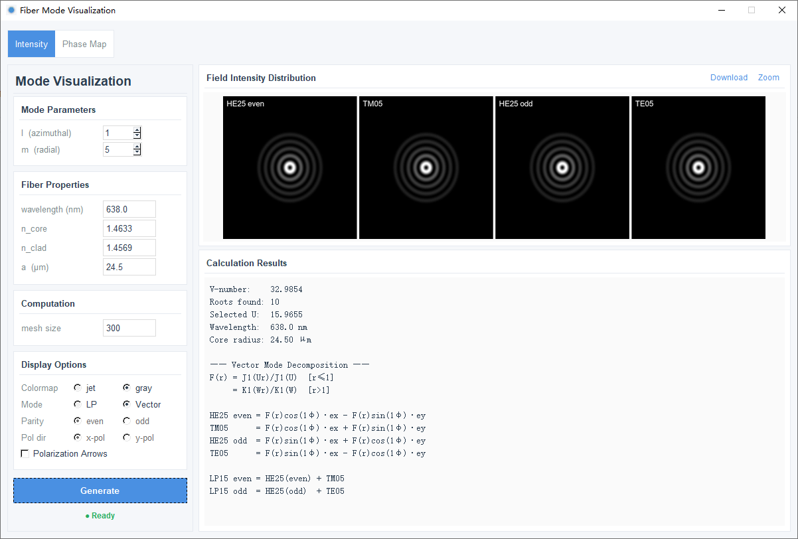
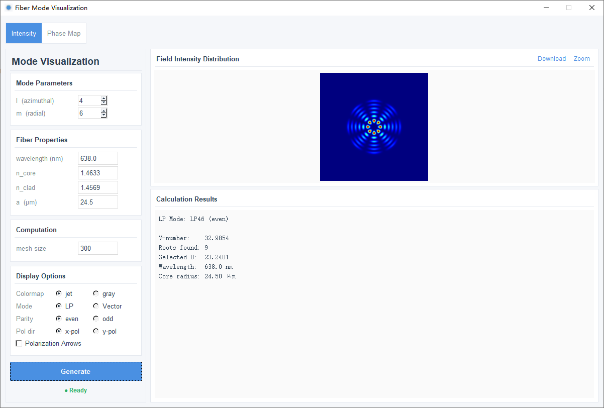
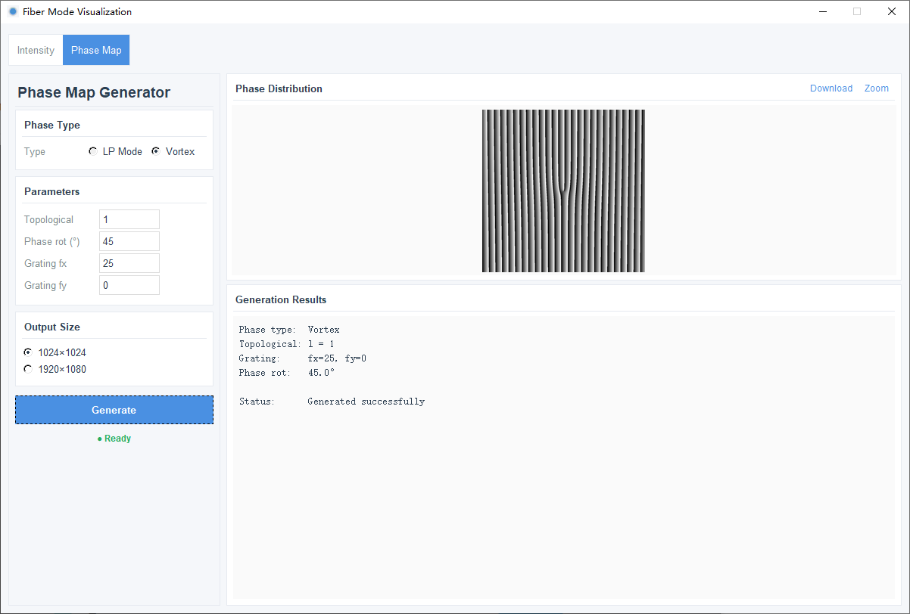

# Fiber Mode Visualization

A Python application for visualizing optical fiber modes and generating phase maps using tkinter and Pillow.

## Features

### Intensity Tab
- **LP Mode Visualization**: Calculate and display LP (Linearly Polarized) mode intensity distributions
- **Mode Parameters**: Adjust azimuthal order (l), radial order (m), wavelength, core/cladding refractive indices, and core radius
- **Display Options**:
  - Colormap selection (jet, gray)
  - Mode overlay (LP, Vector 1×4)
  - Parity selection (even, odd)
  - Polarization direction (x-pol, y-pol)
  - Polarization arrows visualization
- **Real-time Computation**: Multi-threaded calculation for responsive UI
- **Export**: Save intensity distributions as PNG images

### Phase Map Tab
- **LP Phase Distribution**: Generate phase maps from LP mode calculations
- **Vortex Phase**: Create optical vortex phase patterns with tunable topological charge
- **Size Options**: Choose between 1024×1024 (square) or 1920×1080 (wide) resolution
- **Phase Modulation**:
  - Phase rotation (angular modulation)
  - Blazed grating orders (fx, fy) for beam steering
- **Export**: Save phase maps as PNG images


## Examples









## Requirements

- Python 3.8+
- numpy
- scipy
- Pillow (PIL)
- tkinter (usually included with Python)

## Installation

```bash
pip install numpy scipy Pillow
```

## Usage

```bash
python main.py
```

## Performance Notes

- LP mode computation is multi-threaded to prevent UI freezing
- High-resolution phase maps (1920×1080) are generated at full resolution
- Image display uses thumbnail scaling for responsive rendering

## License

MIT License

## Author

Licheng Gao

